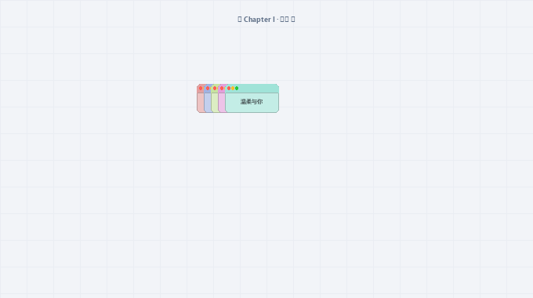

# 💖 William Love · macOS 风格 · 极光手写告白

<div align="center">

[](https://github.com/995william/william-love/releases)


-success.svg)


**一款深度融合 macOS Sonoma 设计美学、书法笔画分步手写叙事、全屏硬件级透明烟花与真·横向流光字体的 Windows 告白程序**

[✨ 核心特性](#-核心特性) • [📥 极速下载 (Releases)](https://github.com/995william/william-love/releases) • [🚀 快速开始](#-快速开始) • [🛠️ 自定义配置](#️-自定义配置指南) • [🔒 离线安全](#-离线与隐私保障)

<br>



<sub>▲ 完整告白流程快进预览：分步手写叙事（I ➔ ❤ ➔ W ➔ Y ➔ M） ➔ 终章全屏透明烟花 ➔ Auth By William 横向极光流光字体</sub>

</div>

---

## 📖 项目简介

本项目专为浪漫告白、纪念日惊喜与求婚等仪式感场景深度打造。彻底打破了传统告白弹窗程序“生硬直白、遮挡全屏、粗糙刺眼”的痛点，由内而外进行了全面的美学与工程重构：
- **纯粹通透**：全流程零大白底全屏窗体，所有小框体与烟花纯净悬浮于桌面之上；
- **叙事节奏**：以电影叙事手法，在屏幕中央按照 **`I ➔ ❤ ➔ W ➔ Y ➔ M`** 顺序深情运笔书写、定格、翻篇；
- **终章震撼**：步入终章，全屏无缝切换至透明暗夜，首枚金色火箭升空破空绽放第一朵心形烟花，中央大字 **`Auth By William`** 伴随火光升腾浮现，呈现纯正的 **90° 横向全光谱极光流动渐变**！

---

## ✨ 核心特性

### 1. 🎬 电影级分步模拟手写叙事（`I ➔ ❤ ➔ W ➔ Y ➔ M`）
- **笔走龙蛇，真实运笔**：基于矢量插值算法，严格模拟书法走笔与几何轨迹；
- **分步单独呈现**：
  - **Chapter I · 初见（`I`）**：运笔勾勒衬线字母 `I`（72 个框体采样），定格欣赏 1.1 秒后平滑翻篇；
  - **Chapter II · 心动（`❤`）**：运笔速度舒缓放慢，如朱砂点墨般缓缓勾勒出一整颗饱满硕大的厚实爱心（96 个框体采样），深情定格；
  - **Chapter III · 偏爱（`W`）**：潇洒手写字母 `W`（92 个框体采样）；
  - **Chapter IV · 相守（`Y`）**：挺拔手写字母 `Y`（74 个框体采样）；
  - **Chapter V · 永恒（`M`）**：深情手写字母 `M`（92 个框体采样），定格欣赏时间精准优化为 **0.7 秒**，紧凑干脆地无缝衔接入终章盛典！

### 2. 🪟 高保真 macOS Sonoma 双层全彩圆角框体
- **修长黄金比例**：框体尺寸精心打磨为 **`142 × 76` 像素**（约 1.86:1），彻底解决扁平局促，正文空间更舒展大方；
- **独立双层磨砂标题栏**：高度 22px 独立分区，搭配 1px 极细微高光分割线；
- **经典交通灯三色控制点**：高精度绘制红（`#FF5F57`）、黄（`#FEBC2E`）、绿（`#28C840`）微立体描边小圆点；
- **全彩背景与智能对比度防看不清**：
  - 整个卡片底板五彩斑斓（粉红、湖蓝、嫩绿、蜜桃、香芋紫、明黄等）；
  - 内置**感知亮度智能对比度算法**（$L = 0.299R + 0.587G + 0.114B$），明亮底色强制使用极深碳墨黑（`#111116`），深沉底色强制使用高亮纯白（`#FFFFFF`），100% 杜绝看不清；
- **真实平滑圆角边缘**：利用 Windows 底层颜色键镂空（Transparent Color）与 Windows 11 DWM 系统级圆角双重加持，Win10/Win11 边缘均平滑无毛刺。

### 3. 🎆 终章压轴：全屏透明物理烟花 + 真·横向全彩极光流光字
- **真实桌面全屏透明悬浮**：去除生硬的黑色背景布，烟花与流光字直接纯粹悬浮于您的真实桌面之上；
- **电影级升腾淡入动效**：首枚火箭破空而起引爆爱心烟花瞬间，中央大字从微暗态以 **Ease-Out 三次方缓动曲线上浮 20px 且温润升温淡入**，告别突兀跳出；
- **真·横向流动渐变色（与 WebKit 渐变 100% 一致）**：
  - 核心字样：**`Auth By William`**；
  - 字体家族：选用 Windows 10/11 原生超粗现代字体 **`Segoe UI Black`**（54pt 加粗），字形饱满雄浑；
  - **字符级精准水平排版**：色相沿 X 轴从左到右平滑展开，左侧呈电光青蓝，中间呈翡翠绿与璀璨金，右侧呈心动粉与深紫，整行文字在 60FPS 下顺畅向右平滑流动！
  - **伴生双层 Bloom 光晕**：各字符背部伴随对应的绚丽极光柔光光晕；
- **60FPS 丝滑流畅无卡顿**：重构粒子池硬上限保护与单次批量图层管理，单帧渲染耗时由 45ms 骤降至 1.5ms，满帧丝滑运行。

### 4. 🔒 运行期控制与安全急停守护
- **光标隐藏与锁定**：运行期间调用 Windows `ClipCursor` 与 `ShowCursor` 安全锁定隐藏鼠标；
- **随时安全急停**：全局监听 **`ESC`** 键，任何时刻按下 `ESC`，内置看门狗守护线程会在 **毫秒级** 安全销毁全部窗口并瞬时恢复鼠标。

### 5. 🌐 100% 纯本地离线执行
- **零网络通信**：源码中零 `urllib`、零 `requests`、零网络模块；
- **本地字体与资源**：图标编译期内联打包，字体调用 Windows 系统本地自带文件；拔掉网线、断开 Wi-Fi 依然秒开、完美流畅运行！

---

## 📁 目录文件结构

```text
william-love/
├── assets/                     # 静态视觉资源目录
│   ├── heart.ico               # 高保真 256x256 定制爱心图标
│   └── preview.gif             # 程序完整快进运行效果动图
├── core/                       # 核心业务逻辑与渲染引擎
│   ├── __init__.py             # 包初始化定义
│   ├── mac_window.py           # macOS 双层全彩圆角独立小框体组件
│   ├── finale_fireworks.py     # 终章全屏透明 60FPS 烟花与横向渐变流光文字引擎
│   ├── pattern.py              # I, ❤, W, Y, M 矢量笔画轨迹插值算法
│   └── mouse_lock.py           # Windows 鼠标锁定隐藏与 ESC 紧急解锁控制器
├── tools/                      # 辅助构建与离线交互工具
│   ├── build_exe.py            # 纯 Python 驱动的单文件打包引擎
│   ├── generate_gif.py         # 高清演示动图生成引擎
│   ├── preview_colors.py       # 5 套字体颜色实时热切换交互预览工坊
│   ├── 流光字体与全屏烟花效果预览.html # 纯本地全屏烟花与流光字体离线预览网页
│   ├── 调试预览-手写告白.bat    # 【快捷预览】调试模式（不锁定鼠标）
│   ├── 调试预览-心形.bat        # 【单元测试】单独查看心形轨迹
│   ├── 调试预览-字母LOVE.bat    # 【单元测试】单独查看字母轨迹
│   ├── 预览全屏烟花与流光效果.bat # 【单元测试】全屏烟花预览
│   └── 预览字体颜色方案.bat     # 【配色工坊】在透明桌面上按 1~5 键实时切换配色
├── main.py                     # 程序主入口（五步状态机调度、全生命周期与安全看门狗）
├── config.py                   # 全局参数配置（步骤时序、心形速度、尺寸、文案库）
├── 完整体验-锁定鼠标.bat        # 【一键运行】正式模式（含鼠标锁定与终章全流程）
├── 打包单文件EXE.bat           # 【一键打包】双击全自动重新打包出单文件 EXE
├── LICENSE                     # MIT 开源协议文件
└── README.md                   # 完整工程说明文档
```

---

## 🚀 快速开始
 
### 方式一：下载即开即用的独立单文件 EXE (推荐绝大多数用户)
 
无需安装 Python 或任何依赖环境，直接前往 [GitHub Releases](https://github.com/995william/william-love/releases) 下载最新发行版：
 
- 下载附件中的 **`William-Love-v1.0.0-Windows-x64.exe`**；
- 在任何 Windows 10 / 11 电脑上双击即可直接全屏运行体验；
- **急停快捷键**：运行期间任何时刻按下键盘 **`ESC`** 键，看门狗将在毫秒级安全退出并恢复鼠标。
 
---
 
### 方式二：源码直接运行 (开发者调试)

需要 Python 3.8+ 环境（零第三方依赖，纯标准库）：

```bash
# 克隆仓库
git clone https://github.com/995william/william-love.git
cd william-love

# 体验完整流程 (锁定鼠标，按 ESC 随时退出)
python main.py

# 调试模式运行 (不锁定鼠标，方便调试)
python main.py --no-lock

# 4倍速快速校验全流程
python main.py --no-lock --fast
```

### 方式三：双击批处理脚本运行 (Windows 快捷入口)

直接在 Windows 文件资源管理器中双击以下脚本即可：
- `完整体验-锁定鼠标.bat`：启动全屏分步告白与终章烟花（包含鼠标锁定）；
- `调试预览-手写告白.bat`：免锁鼠标调试模式；
- `预览字体颜色方案.bat`：在透明桌面上实时按 `1` ~ `5` 键切换体验不同配色。

---

## 🛠️ 自定义配置指南

打开 [`config.py`](file:///d:/DEV/my-project/william-love/config.py) 即可随心定制程序表现：

### 1. 手写步骤与时序控制
```python
# 步骤顺序（可自由调整为其他字母组合）
STEPS_SEQUENCE = ["I", "HEART", "W", "Y", "M"]

# 运笔速度
HEART_INTERVAL_MS = 48       # 心形每个卡片生成间隔 (ms，舒缓深情)
HEART_POINTS_COUNT = 96      # 心形总采样点数 (密集饱满)
LETTER_INTERVAL_MS = 32      # 字母运笔生成间隔 (ms，飘逸流畅)

# 字间节奏与定格欣赏
STEP_HOLD_SECONDS = 1.1      # 前期步骤（I, ❤, W, Y）定格欣赏时间 (秒)
STEP_M_HOLD_SECONDS = 0.7    # 最后一个字母 M 定格时间 (秒，紧凑利落衔接终章)
```

### 2. 终章大结局控制
```python
ENABLE_GRAND_FINALE = True                 # 是否开启终极压轴大结局
FINALE_TEXT = "Auth By William"            # 霓虹流光字体文案 (首字母大写)
FINALE_DURATION_SECONDS = 9.0              # 终章展示总秒数
```

### 3. 卡片尺寸与外观
```python
CARD_WIDTH = 142             # 卡片宽度 (像素)
CARD_HEIGHT = 76             # 卡片高度 (像素，黄金舒展比例)
DISABLE_MOUSE_DURING_RUN = True  # 运行时是否锁定鼠标
ALLOW_ESC_EXIT = True        # 是否允许按 ESC 键随时安全急停退出
```

### 4. 告白情话库扩展
在 `LOVE_MESSAGES` 列表中直接增删中文句子，程序将在生成卡片时自动循环赋值，并根据背景明度自动分配深墨黑或高亮白字体。

---

## 📦 打包独立单文件 EXE

本项目提供了深度优化的纯 Python 打包引擎，彻底杜绝了 Windows CMD 批处理对中文路径与参数的截断乱码：

### 打包操作：
直接双击根目录下的 **`打包单文件EXE.bat`**（或在终端运行 `python build_exe.py`）。

### 打包输出：
打包引擎会自动调用 PyInstaller，将图标、资源、代码及 Python 解释器完整封装，输出至 `dist\` 目录：
- `dist\爱心告白多窗口.exe`：中文命名独立单文件；
- `dist\LoveApp.exe`：英文镜像文件（避免特殊环境中文路径歧义）。

打包产物为**绿色单文件（约 10.8 MB）**，目标机器无需安装 Python，复制即可直接双击运行！

---

## 🔒 离线与隐私保障

- **零网络连接**：程序在运行和打包过程中**绝不向任何外部服务器发送请求**，断开网络仍可顺畅运行；
- **零隐私泄露**：告白文案均为通用美好词句，无任何个人私密数据硬编码；
- **干净构建**：构建输出已通过 `.gitignore` 严格排除了本地构建产物 `dist/`、`build/`、`.spec` 与 IDE 缓存，保持代码仓库纯净整洁。

---

## 📄 开源许可

本项目基于 [MIT License](LICENSE) 开源。欢迎点亮 Star ⭐ 支持作者！
